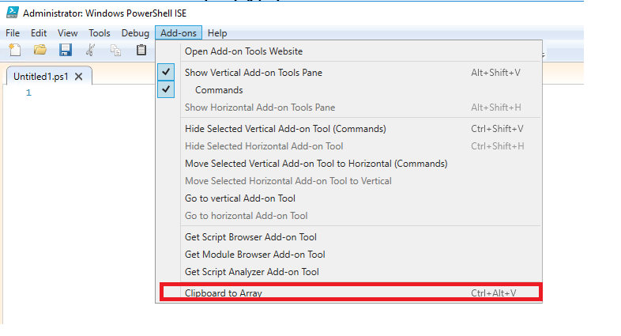

# Get-ClipArray
Turns Clipboard into Powershell Array

## The idea:
During my workday I often get lists of users, computers, ...  as email, excel and text files. E.g. put some computers to a group. 
Mostly I use cut and paste as a prefered way to get data from one application to another. 
To use the data from the lists in powershell, you need to have the data as an array.

Finally paste the array with a shortcut like ctrl + alt + c into powershell


## The function behind
The function has to be  added to your powershell profiles or  loaded in your standard module. In further documentation I describe the profile way
```powershell
function Get-ClipArray {
    [CmdletBinding(SupportsShouldProcess)]
    param()
    [System.Collections.ArrayList]$ClipIn = (Get-Clipboard).Trim()
    #remove last empty line
    if (!$ClipIn[-1]) {
        $ClipIn.Removeat($ClipIn.count - 1)
        $ClipIn
    }
    $Clip = "`$clip = '$($ClipIn -join "', '")' "
    $Clip
    if ($psISE) {
        $psISE.CurrentFile.Editor.InsertText($Clip)
    }
    elseif ($psEditor) {
        $psEditor.GetEditorContext().CurrentFile.InsertText($Clip)
    }
 }
```

## The shortcut and the profiles
For an efficient way using the function  I definded a shortcut  "ctrl+alt+c". 
If no profile is defined you have to create one for Powershell ISE and for VS Code. Just run the following code:
```powershell
If (!(Test-Path $profile)) {
    New-Item $profile -ItemType file –Force
}
$profile

```
I modified the powershell profiles for ISE and VS Code add the line
`. C:\YourPath\Get-ClipArray.ps1`
for loading the function(change YourPath as needed).
  - **PowershellISE**  
Defining the shortcut in ISE starts with `$psISE.CurrentPowerShellTab.AddOnsMenu.SubMenus.Add(...`
   
    The complete ISE profile `Microsoft.PowerShellISE_profile.ps1`:
       ```powershell
        # load function 
        . C:\YourPath\Get-ClipArray.ps1
        
        # create keyboard shortcut
        $psISE.CurrentPowerShellTab.AddOnsMenu.SubMenus.Add(
          'Clipboard to Array',
          {
            Get-ClipArray
          },
          'Control+Alt+C'
        )
      ```  
      In ISE you can see the result under menue Add-ons:

      


 - **Visual Studio Code**  
 In Visual Studio Code we have to register the command as an additional Powershell command. For details see 
 https://jdhitsolutions.com/blog/powershell/5907/extending-vscode-with-powershell/  
   
   The complete VS Code Powershell profile `Microsoft.VSCode_profile.ps1`:
      ```powershell
      # load function
       . C:\YourPath\Get-ClipArray.ps1

      # Register Command in VS Code
      Register-EditorCommand -Name "MyClipArray" -DisplayName "Get Clipboard and convert to Array" -ScriptBlock {Get-ClipArray} -SuppressOutput
      ```  
         
      Keyboard shortcut key has to be defined manually in VS Code.
      Go to File – Preferences – Keyboard Shortcuts and then click the link to edit keybindings.json
      Insert code below

      ```json
      {
      "key": "ctrl+alt+c",
      "command": "PowerShell.InvokeRegisteredEditorCommand",
      "args": { "commandName": "MyClipArray"},
      }
      ```
      
https://jdhitsolutions.com/blog/powershell/5907/extending-vscode-with-powershell/


