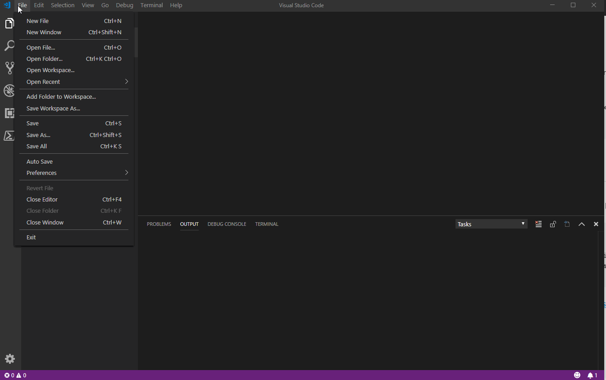

# Get-ClipArray
Turns Clipboard into Powershell Array

## The idea:
During my workday I often get lists of users, computers, ...  as email, excel and text files. E.g. put some computers to a group. 
Mostly I use cut and paste as a prefered way to get data from one application to another. 
To use the data from the lists in powershell, you need to have the data as an array.

Finally paste the array with a shortcut like ctrl + alt + c into powershell


## The Function behind
```
function Get-ClipArray {
    [CmdletBinding(SupportsShouldProcess)]
    param()
    [System.Collections.ArrayList]$ClipIn = (Get-Clipboard).Trim()
    #remove last empty line
    if (!$ClipIn[-1]) {
        $ClipIn.Removeat($ClipIn.count - 1)
        $ClipIn
    }
    $Clip = "`$clip = '$($ClipIn -join "', '")' "
    $Clip
    if ($psISE) {
        $psISE.CurrentFile.Editor.InsertText($Clip)
    }
    elseif ($psEditor) {
        $psEditor.GetEditorContext().CurrentFile.InsertText($Clip)
    }
 }
```

## The Shortcut
For an efficient way using the function  I definded a shortcut 
### PowershellISE

 

  - **PowershellISE**
 - **Visual Studio Code**


```
{
"key": "ctrl+alt+c",
"command": "PowerShell.InvokeRegisteredEditorCommand",
"args": { "commandName": "MyClipArray"},
}
```
https://jdhitsolutions.com/blog/powershell/5907/extending-vscode-with-powershell/
